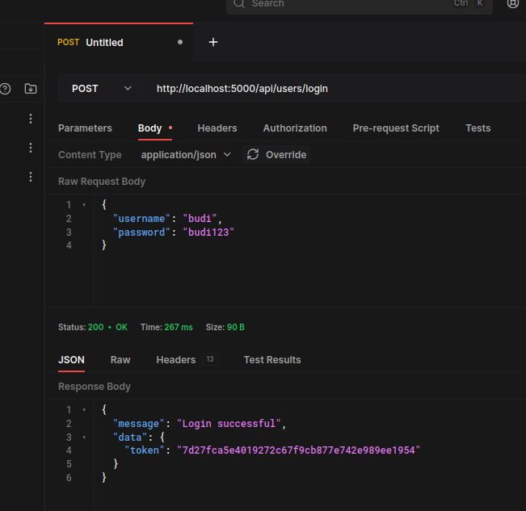
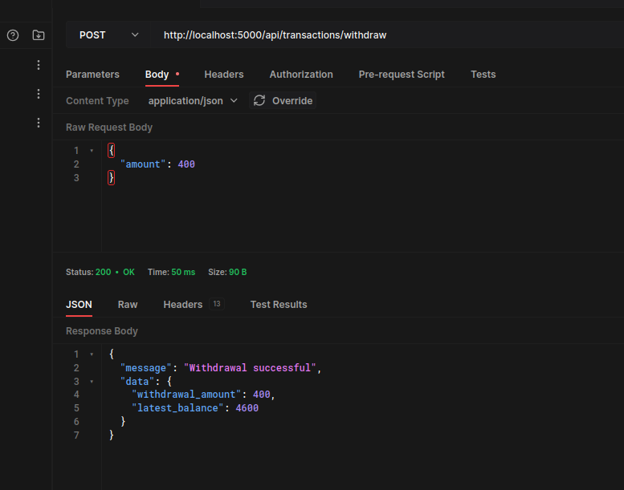

# README
This is A wallet app made for the take-home-test for Raiz Interview

Made using ruby on rails and postgres

## Prerequisites
1. Ruby version 3.1.0
2. Unit test using rspec

## Setup
1. Clone the Repository
2. Copy the env.sample `cp env.sample .env`
3. Fill the .env file with the corresponding credentials mainly regarding the database credentials and port
4. Install dependencies with `bundle install`
5. Setup the database with `rails db:create`
6. Run all the required migration with `rails db:migrate`
7. Run the seed with `rails db:seed`

## Running Unit test
1. Create the test database with `rails db:create RAILS_ENV=test`
2. Run the migration for test database `rails db:migrate RAILS_ENV=test`
3. Run the whole unit test with `rspec`

## Using the app
This section will explain how to use the app with all the available endpoints

### User List
The first endpoint we have is endpoint to list the users available in the database, for the purpose of this demonstration there is no signup functionality, the users will be filled by seed, each user will have their own wallet with its address, and the wallet address will be a randomly generated string for each user

the endpoint for user list is `GET http://{address}/api/users` that can be hit without any authorization

as shown in the example below


### User Login
After we have the user list with their address wallet list, we can proceed with login

the login endpoint is `POST http://{address}/api/users/login`
with the payload 
```
{
    "username": "username"
    "password": "password"
}
```

for the purpose of this demonstration, the user list has already been generated by the seed and will automatically have password of username + 123, so for username budi for example, the password will be budi123, as shown in the example below



after a succesful login, a token will be obtained
all other endpoint below will need a bearer token with that token, otherwise the endpoint will return 401

### User Profile
This is an endpoint to get profile for current user, the current user is determined by the token provided in the Bearer header, 

the endpoint is `GET http://{address}/api/users/profile`
as shown in the example below


we can see the endpoint will provide the information about our data like name, username, wallet address and balance for the wallet


### Transaction Deposit
Our first Transaction Endpoint is to Deposit money into the wallet account, this endpoint must be hit with the token provided by the login endpoint and the deposited money will be into the user's wallet

the endpoint is `POST http://{address}/api/transactions/deposit`
with payload of 
```
{
    "amount": 5000
}
```


in the example we are depositing 5000 into the wallet, can be seen below, the user's latest balance after deposit is shown to be 5000

### Transaction Withdraw
Our next transaction endpoint is to Withdraw money from the wallet account, this endpoint, like the previous one, must be hit with the token

the endpoint is `POST http://{address}/api/transactions/withdraw`
with payload of 
```
{
    "amount": 400
}
```



in the example we are withdrawing 400 from the wallet, can be seen below, the user's latest balance after deposit is shown to be 4600 since previously we deposit 5000 into the account

### Transaction Transfer
Our next transaction endpoint is to transfer money from our wallet account to another person's wallet, this endpoint, like the previous one, must be hit with the token

the endpoint is `POST http://{address}/api/transactions/transfer`
with payload of 
```
{
    "amount": 300,
    "destination_address": "05d08d8660fef2e3b84a"
}
```


in the example we are transferring 300 from our wallet to the address 05d08d8660fef2e3b84a, can be seen below, the user's latest balance after deposit is shown to be 4300 since previously we deposit 5000 and then withdraw 400 into the account, in this example the destination address belongs to User Dedi, in your PC the seed will generate different wallet address each time

### User Wallet Mutation History
This Endpoint is to get data for wallet mutation for your wallet

the endpoint is `GET http://{address}/api/users/wallet`

if we hit it using budi's token we can clearly see the history of transactions we did before, deposit 5000, withdraw 400, and then transfer 300, so the final balance is 4300


On the other hand, we can try hitting this same endpoint using dedi's token (obtained from the login endpoint)
and we can see the history shown a Transfer in amount 300 from budi that we previously did, making dedi's final balance to be 300

